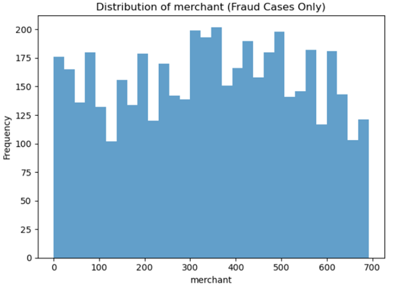
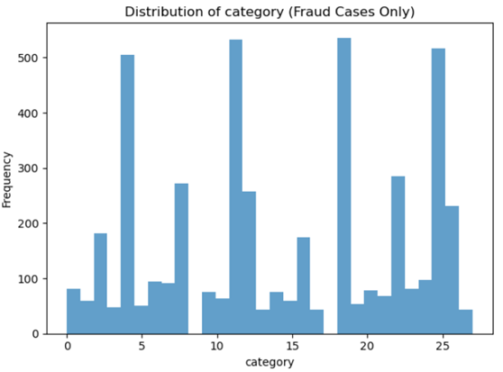
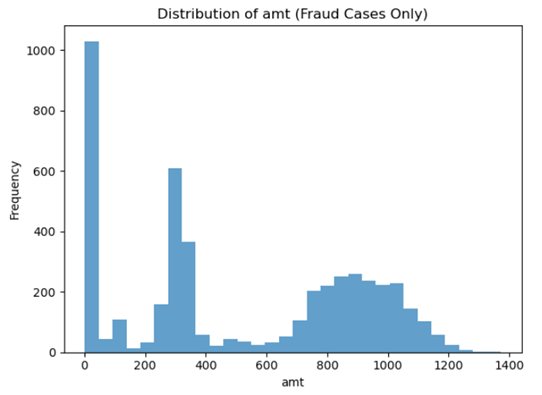
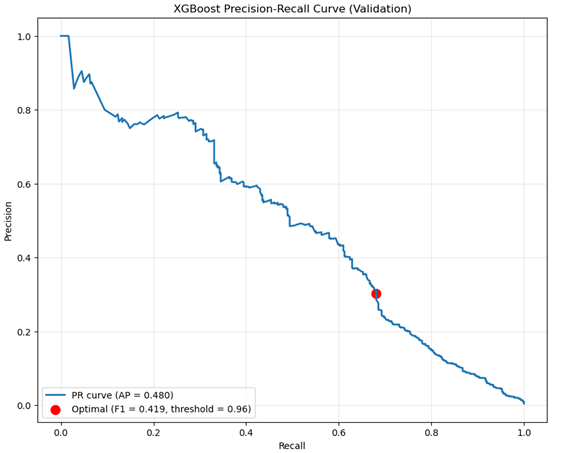
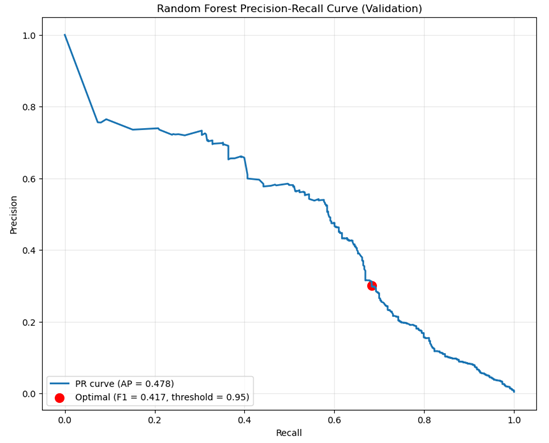
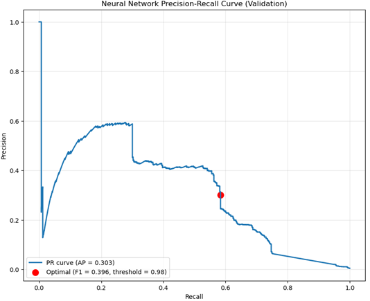

README

Instructions:

1. Copy the three data files to the storage/data_sources folder. Copy your .json input file into the storage/inputs folder.
2. Run the Dockerfile, it builds the container and starts the app.
3. Run the create_dataset endpoint by pointing your browser to:

<http://localhost:5000/create_dataset>

The sampling defaults to stratified but supports random and KFold via keyword.

1. Run the train_model endpoint by pointing your browser to:

<http://localhost:5000/train_model> (to train the default model RF)

<http://localhost:5000/train_model?model=XGB>

<http://localhost:5000/train_model?model=RF>

<http://localhost:5000/train_model?model=NN> (to train a specific model)

1. Run the predict endpoint by merely pointing your browser to <http://localhost:5000/predict>

This works as a GET request because you copied over your input file.

Or use a POST request by modifying this curl call with your file name:  
 curl -X POST <http://localhost:5000/predict> \\

\-H "Content-Type: application/json" \\

\-d @input.json

When you put the file in your current working directory.

1. View the log files in the log folder.

**Written Report for the Prototype Including Design Choices**

**Problem Statement**

The problem at hand is to develop a containerized version of a new machine learning system for SecureBank to detect credit card fraud from a dataset of transactions with identifying information. The following functional requirements were given:  
 System Functional Requirements

- The system should improve on prior performance (30% precision, 60% recall)
- The system should allow administrators to generate a new dataset for training from the available data sources.
- The system should allow administrators to select from a catalog of pre-trained models
- The system should allow administrators to audit the system's performance.

The non-functional requirements that would be considered in production include latency & throughput, resource utilization, scalability and elasticity to loads, reliability and availability, security, maintainability and extensibility, Admin and user usability and accessibility, interoperability, integration, compliance, privacy and regulatory considerations, disaster recovery and business continuity, and lastly, cost-effectiveness and resource efficiency. I decided to measure one aspect of all these many facets, the runtime of my code. My code turned out to be pretty fast, because I have a new computer. I got the following wall times for various parts of my code:

| Code Function | Wall Time |
| --- | --- |
| Data Loading | 3.29 sec |
| Label Encoding | 868 ms |
| EDA | 38.9 sec |
| Dropping Rows and Sampling | 668 ms |
| Feature Engineering | 6.17 sec |
| Data Split | 635 ms |
| Training, Grid Search and Results | 50.2 sec |

_Table 1. Elapsed time for various parts of the code in Jupyter Notebooks_

I don’t think it is necessary to elaborate on the requirements beyond this, because they were set by management and not by me. One thing a developer (and scientist) should always do is stick to the stated requirements, so I’m not going to invent any just to fluff up this portion of the report. I am trying to be brief so I won’t speculate on the finished system I will just speak to the prototype.

**Data**

I was given a database in three parts, when joined made up a data pool of over 1 million rows. The majority class and the target class were extremely unbalanced in favor of the majority class. Upon investigation I found out I could skip imputing and drop rows with missing values because dropping those rows mostly preserved the fraudulent transaction group. Dropping NA rows resulted in 147,866 non frauds dropped , 164,670 with the label missing and only 630 fraudulent transactions dropped. This was my first major design decision. This left 1,334,376 rows from which to build a dataset. I decided to use 90% of this data, which affected performance. With so much data it was hard to know how much of it to start with. This left me with a training set of 960,751 observations, and a validation set and test set of 120,094 observations each, more than enough to get good results.

If the fraudulent transactions were mostly missing that label, this would be indicative of a much larger problem with SecureBank’s data collection procedures. Presumably that label was attributed by the customer service agents in the fraud department, not inferred by the previous ML model at SecureBank. That would be a case of “garbage in, garbage out”, and since data collection is outside of the scope of this project, it’s safe to say we can move forward by dropping rows. The question becomes is there any reason to think that the missing values in the data would tend towards fraudulent transactions? I assumed there is not this connection, and that once again that would be a data collection issue. Moving forward with this ML project we have to assume that the data was collected correctly.

Many columns were deemed unnecessary. The following columns were dropped for the indicated reason:

| Column dropped | Reason |
| --- | --- |
| Trans_num | This has nothing to do with fraud |
| Index_x | This is just an index |
| Index_y | This is just an index |
| Cc_num | This indicates customers |
| Unix_time | I broke the time down into it’s components elsewhere |
| Merch_lat | I preferred to track merchants by name |
| Merch_long | I track the merchants by name, also fraud can occur online |
| First, Last | This indicates the customer not the fraud |
| sex | We need to stop fraud regardless of customer gender |
| Street, city, zip | The customers location was found to be weakly predictive in EDA |
| dob | We need to stop fraud for customers of all ages |
| Year_date | This is a non-repeating feature that doesn’t generalize |

Sampling was considered, and because of the class imbalance stratified sampling of 90% of that data was preserved for training. The system also supports random sampling and KFold sampling which can be activated with a keyword.

**Feature Engineering**

EDA provided other insights. Looking at a plot of fraud cases, the merchant used was not strongly determinative, and looking at the fraud cases alone it was apparent that frauds occurred at all the merchants in the database with relative uniformity, so that column was dropped:

 _Fig. 1: relative uniformity of frauds for all merchants_

The job, day_of_week, minute, and second of the fraud was not strongly indicative so these columns were dropped. However, the same view of category of purchase revealed the frauds concentrated in about 9 categories with 4 or more of them extremely prominent, so a feature could be engineered focusing on these categories:

 _Fig. 2: Fraud counts for purchase category_

The log transformed amount of the transaction had a trimodal distribution which only overlapped with non fraud at small amounts. The raw feature and a suspicious amount feature after discretization into bins would make for good features:  

 _Fig. 3: Log transformation of amount column_

This left us with trans_date_trans_time, day_of_week, day_date, month_date, hour, amt, city_pop, and category, in total 8 raw features. Hour, day of week, and month had peaks in the distributions. The preceding charts are just a sample of the exploratory data analysis (EDA) I did. The day_date and month_date distributions had peaks, but not an extreme grouping so I left them out. Also, presumably the system would want to detect frauds at any time during the month and year, but there were certain hours that were more offensive. Looking at all the categorical data and thinking about the binary classification task, I decided to go with binary features other than the “log_amt” column. Now I was ready to rank feature importance with a random forest and also use it to perform a recursive feature elimination, after testing some models on the whole feature set. The pertinent information on fraud seemed to be mostly time and amount based.

_Fig 4. Correlation of final features with the Fraud label_

This left me with the following binary features: the top 10 category for fraud, the top 2 jobs for fraud, the top 6 purchase categories for fraud, the top 6 months for fraud, the top 3 days for fraud, and whether or not it was a suspicious amount which was created by binning the transaction amounts above $20, calculating the fraud rate for each bin, getting the overall fraud rate, and selecting the bins with significantly higher fraud rates, (greater by a factor 2)

I’d also tried to craft a feature that groups the transactions by cc_num and identifies when many more transactions than normal have occurred in the last hour and the last 24 hours based on unix_time. This required establishing a frequency average of transactions for the fraud_label == 0 transactions when grouped by cc_num and comparing it to a fraudulent transaction frequency. I confirmed there was a difference in EDA, but could not get a highly correlated feature when I tried to prepare it. This also significantly increased training time, and I had already improved on previous performance using other features so the feature was abandoned. After that then I to dropped the original columns of the dataset and just kept the binary engineered features and log_amt.

**Models**

Because I had mostly binary features (most raw features required binning) I knew that tree-based models would be most appropriate and perform best on my feature set. I added a plain vanilla neural network to round out my model choices, but performance was terrible until I implemented 0.5 dropout and batch normalization on a hidden dimension of 32. Hyperparameter tuning was accomplished using a wide grid search at first, with code that selected the best model parameters in training for each search. This allowed me hone in on which combinations of parameters yielded the best result for these models, sliding my hyperparameters up or down and getting more granular as the results came in.

My initial grid search started at random values and at the end encompassed:

xgb_param_grid = {'n_estimators': \[100, 150, 200, 300, 400\], 'max_depth': \[10, 15, 20, 25, 30, 50, 100\],'learning_rate': \[0.1\]} rf_param_grid = {'n_estimators': \[100, 200\], 'max_depth': \[None, 10, 15, 20, 30\], 'min_samples_split': \[2, 3, 5, 7, 10, 12\]} nn_param_grid = 'hidden_dim': \[40, 50, 60, 70, 100\], 'num_hidden_layers': \[1\], 'lr': \[0.1\], 'num_epochs': \[10, 15\], 'batch_size': \[32\]}.

Through a process off trial and error the final best hyperparameters it settled on were:

| XGBoost: {'learning_rate': 0.1, 'max_depth': 10, 'n_estimators': 100} |
| --- |
| Random Forest: {'max_depth': 10, 'min_samples_split': 12, 'n_estimators': 200} |
| Neural Network: {'batch_size': 32, 'hidden_dim': 50, 'lr': 0.1, 'num_epochs': 10, 'num_hidden_layers': 1} |

_Table 2: Best Hyperparameters after dozens and dozens of runs_

**Metrics**

For a credit card detection algorithm, there are many offline and online metrics to consider to evaluate the performance of the system. Since the requirements were to improve upon precision and recall, with a focus on recall, these offline metrics were the metrics measured in my testing and the ones used for model selection. Other metrics measured were Area under the Receiver Operating Characteristic (ROC-AUC) curve, which measures overall separability, and Area under the Precision-Recall curve, which is more informative on imbalanced data. An optimal threshold was defined as the point in the PR-Curve that maintained a30% or greater precision while maximizing recall. This led to the following optimal thresholds for each model on the validation set:

  

_Fig. 5 PR-Curves for the models (validation set)_

A Confusion Matrix was also applied, which utilized the False Positive Rate (FPR) = FP/(FP+TN) and the False Negative Rate (FNR) = FN/(FN+TP). F1 was avoided because it weighs FP as equally important with FN, but in our case FN is much more important. Other offline metrics that could have been calculated include: Brier Score, a Calibration Curve, Expected Monetary Cost, Cost-Benefit Ratio, Adversarial or Stress Testing, and more.

Although they were not calculated in this prototype, various metrics would be important to observe once results are being collected on inference for unseen data like: Demographic Parity Difference, Equalized Odds (both respecting protected demographics, like females and minorities), and performance metrics like Inference Latency, Throughput, Memory/CPU Utilization, and more. These metrics, although they can be collected in training and used for model selection, become even more important in production. I didn’t move forward with that. However, the best practice is to measure and choose a model based on these results as well. Given space and time considerations I made my choice instead based purely on precision and recall, strictly sticking to the requirements. In my results on the test set, the Random Forest was crowned champion by a small margin:

| Model Selection Based On Precision and Recall | Training |     |     | Test Set |     | Test Set |     |
| --- | --- | --- | --- | --- | --- | --- | --- |
| Model and Best hyperparameters: | precision | recall | probability threshold | precision | recall | ROC AUC | PR AUC |
| XGBoost: {'learning_rate': 0.1, 'max_depth': 10, 'n_estimators': 100} | 0.303 | 0.681 | 0.956 | 0.31 | 0.7 | 0.987 | 0.496 |
| Random Forest: {'max_depth': 10, 'min_samples_split': 12, 'n_estimators': 200} | 0.301 | 0.69 | 0.938 | 0.32 | 0.72 | 0.987 | 0.543 |
| Neural Network: {'batch_size': 32, 'hidden_dim': 50, 'lr': 0.1, 'num_epochs': 10, 'num_hidden_layers': 1} | 0.3 | 0.589 | 0.976 | 0.3 | 0.62 | 0.956 | 0.374 |

_Table 3. Training and Test set results for models_

In production, various live performance metrics become important, including real-time precision and recall, the False Alert Rate and the Missed Fraud Rate. The alert and investigation workload can be evaluated with metrics like Alerts per Day, Investigation Turnaround Time (which reflects on the system), Analyst Utilization and so on. Financial impact can be measured by Fraud Losses Averted, Operational Cost, ROI and such. Drift Detection becomes important and can be measured with Data Drift Metrics (Statistical tests on feature distributions) and Concept Drift Indicators. Feedback-Loop and Model Health can be weighed up using Retraining Triggers, and Post-Retraining Validation. The Customer Experience and Compliance must also be monitored with such metrics as False-Positive Customer Impact , Regulatory metrics, and Audit Metrics. Lastly, System Reliability must be watched on fronts like Uptime, Availability, and Mean Time to Recover.

All of these metrics would be important to measure for a system in production at an actual bank. Given the volume of metrics important to the system, and length limitations on this report, I thought it sufficient to be just aware of these metrics for now and go in depth with them once the prototype three models were approved. At that point a refined selection could be chosen. This is another major design decision I want to note (NOT to calculate additional metrics), and I want to argue for it, that in fact measuring any or all of these additional metrics would be premature given the likelihood that features need to be re-engineered. Many of the features I tried to engineer didn’t work (like transaction frequency and interaction terms) for some reason, showing very, very low correlation to the target class (useless), and here is where I would ask for help feature engineering in fact. Much higher performance on the test set is possible, but I need someone to help debug my code. I thought it would be realistic to point out that some design decisions are made in the face of failure, and this section has gotten too long already. I still consider the prototype a success because it meets the stated requirements, so that’s what I focused on: Precision and Recall on the test set, specifically improving recall.

**Policy Decisions**

As your fraud detection system moves from development into production, a comprehensive set of deployment and post-deployment policies must be in place to ensure it delivers on business objectives, safeguards customer data, and remains adaptable to changing risks and regulations.

First, before the system ever sees live traffic, you need to verify that it integrates cleanly with your existing infrastructure. That means defining secure, well-documented APIs and middleware layers to normalize transaction data between legacy banking systems, CRM platforms, and your fraud module. You should subject the end-to-end pipeline to rigorous load and stress testing, establishing clear SLAs for how quickly fraud alerts must be generated and acted upon under peak demand. To avoid any unintended impact on production workflows, maintain separate test, staging, and production environments so that new models or configuration changes can be validated under realistic conditions before go-live.

Security and data governance go hand in hand with infrastructure readiness. All transaction data and model predictions must travel over encrypted channels, with data masking, anonymization, or tokenization protecting personally identifiable information in line with GDPR, CCPA, or other relevant regulations. Access to raw data, system parameters, and override functionality should be governed by strict role-based access control, with permissions reviewed regularly to reflect changes in responsibilities. Every decision the system makes—whether flagging a transaction or allowing it—must be logged in an immutable audit trail retained for the period required by regulators, ensuring full traceability for both internal reviews and external audits.

Model governance and risk management policies help you maintain confidence in your predictive engine. Before deployment, each model version should undergo back-testing against historical fraud cases, as well as simulation-based stress tests using synthetic or adversarial data to probe edge-case behavior. If you rely on any third-party models or services, vendor oversight policies must verify that those components meet your own security, performance, and compliance standards. All changes to model code, configuration, or data pipelines should be tracked under a formal change-management process that records who made what change, why, and when, so you can roll back or audit any update at a moment’s notice.

Equally important is ensuring that everyone in the organization understands how the fraud system works and what its limitations are. You’ll want to brief compliance, IT, customer-service, and risk-management teams on how alerts are generated, how to interpret them, and when human intervention is required. Internally, detailed documentation, training workshops, and FAQs will empower employees to use the system effectively. Externally, you should prepare customer-facing communication protocols that strike a careful balance between transparency—so users know why their transactions might be blocked—and avoiding unnecessary alarm that could erode trust.

Once the system is live, a new suite of post-deployment policies must govern its ongoing operation. Real-time monitoring should track each alert against key performance indicators such as false-positive rate, detection accuracy, precision, and recall, while batch-oriented reports analyze trends and patterns over longer horizons. Automated dashboards and notification channels will ensure that anomalies in model behavior or data drift are flagged immediately. When drift is detected—whether in customer behavior, transaction patterns, or feature distributions—you’ll need policies dictating how often to retrain the model, how to validate new data, and how to adjust alert thresholds in response to evolving fraud tactics.

A robust feedback loop ties manual review back into continuous improvement. Every suspicious transaction that a human analyst examines should feed its verdict—fraudulent or legitimate—back into your training data so that the model learns from real-world outcomes. Incident-response procedures must define clear escalation paths if there are waves of false positives, undetected fraud spikes, or system outages, including when to involve IT, risk officers, or even law enforcement. After any significant incident, a formal post-mortem should dissect root causes and capture lessons learned, ensuring that both the model and your operational processes improve.

Ongoing compliance and audit readiness remain critical. Schedule regular internal reviews of data access controls, logging practices, and model performance against both corporate policies and external regulations. Maintain protocols for engaging third-party auditors or regulatory agencies, including preparing required performance and compliance reports and cooperating fully during any forensic investigations.

Finally, given the ethical and business stakes of fraud detection, you must continuously monitor for bias in your algorithms to ensure that no customer segment is unfairly targeted. Transparency policies—both internal and customer-facing—should explain, in clear language, how decisions are made and what recourse customers have if they believe they were treated unfairly. Grievance-redressal procedures must allow customers to contest and appeal decisions, triggering human review and, where appropriate, remedial action.

Throughout the system’s lifecycle, maintain a rolling cost-benefit analysis to measure the financial impact of false positives (for example, investigation costs and customer inconvenience) versus the value of prevented fraud losses and reputational gains. Align your KPIs not only with technical metrics like recall and precision, but also with broader business goals such as customer satisfaction scores, operational efficiency, and compliance adherence. By weaving these deployment and post-deployment policies into every stage of your fraud detection pipeline, you’ll build a system that is not only accurate and performant, but also resilient, fair, and trusted by regulators, stakeholders, and customers alike.

All this being said, one design decision I would make regarding policy is definitely have environment segregation moving forward from the prototype. We should enforce environment segregation by ensuring that production data, high-sensitivity logs, and stringent SLAs remain completely isolated from our staging and development environments. Locking down our deployment policies by encoding stricter requirements—such as tighter SLAs or extended log-retention periods—directly in our production configuration files, keeps our core codebase stays clean and uncluttered. And to guarantee compliance and auditability, we will keep all regulatory-mandated settings (encryption keys, retention schedules, RBAC rules, etc.) under version control in environment-specific files.

**Conclusion**

In closing out this prototype report, it’s helpful to spotlight one concrete design decision drawn from each major section:

From the **Problem Statement**, we chose to benchmark only the end-to-end runtime of our notebook code rather than invent new non-functional requirements. By measuring wall-clock times for data loading, feature engineering, and model training, we stayed strictly within the management-defined scope while still demonstrating system performance.

In the **Data** phase, our first major design decision was to drop all rows with missing values instead of imputing them. This preserved nearly all fraudulent examples and simplified downstream processing, leaving us with a clean pool of 1.33 million transactions.

During **Feature Engineering**, we ultimately distilled dozens of raw fields down to a handful of binary indicators—most notably a “top n” feature that flags purchases in the six categories most commonly associated with fraud—and a log-transformed amount. That choice balanced predictive power against complexity and kept our feature set tightly focused.

When selecting **Models**, we recognized that our largely binary feature matrix would best suit tree-based learners, so we prioritized Random Forest and XGBoost (with a vanilla neural network serving as a foil). A broad grid search refined each algorithm’s hyperparameters—such as 200 trees at max depth 10 for the forest and 100 boosting rounds at depth 10 for XGBoost—ensuring a rigorous apples-to-apples comparison.

In the **Metrics** section, we decided to anchor model selection solely on precision and recall—specifically, finding the point on the precision–recall curve that holds precision at 30 percent while maximizing recall—instead of diverting effort into secondary measures like calibration or cost-benefit ratios. We noted better performance would be possible with more informative features.

Finally, under **Policy Decisions**, we committed to strict environment segregation through separate, version-controlled configuration files for development, staging, and production. This ensures that sensitive production data, high-sensitivity logs, and tight SLAs cannot accidentally bleed into less secure environments.

Together, these design choices—from runtime benchmarking to environment-specific configs—formed a cohesive, disciplined approach to building, evaluating, and governing a robust fraud detection prototype.

